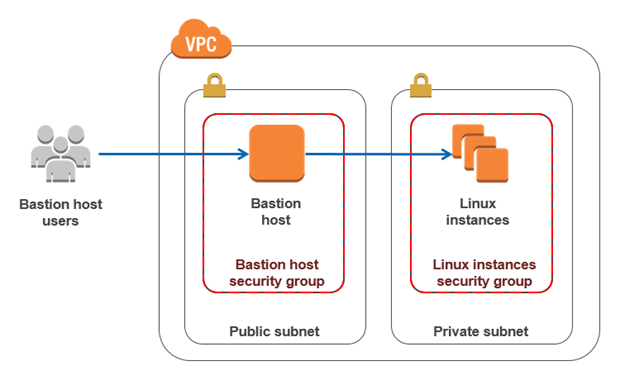

### Amazon Virtual Private Cloud(VPC) Endpoint

```java
// guide: https://www.youtube.com/watch?v=ZdVYBNgsA5Q&list=PLjCpH2Qpki-sTjdlYXE8AifSKQFa8ZL23&index=35

Internet -> (Internet Gateway) -> VPC -> (Routing Table) -> (Network ACL) -> (Security Group) -> (Bastion Host) -> Service

Lab
  create customize VPC
  create EC2 public & private in subnet
  create IAM Role for EC2 able access to S3
  test connect to S3
  list S3
  aws s3 ls --region=eu-west-3
```