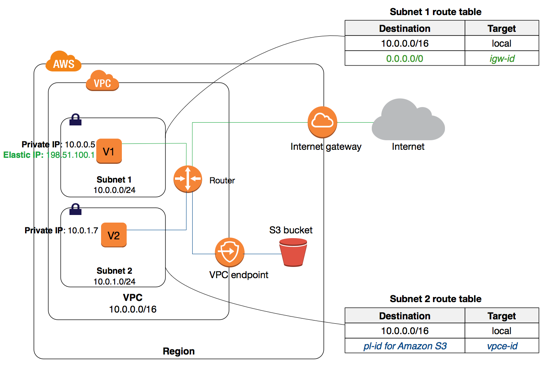

### Amazon Virtual Private Cloud(VPC) Endpoint
#### Gateway VPC endpoints
- Amazon S3
- DynamoDB

```java
// guide: https://www.youtube.com/watch?v=ZdVYBNgsA5Q&list=PLjCpH2Qpki-sTjdlYXE8AifSKQFa8ZL23&index=35

Private Subnet -> using(Gateway PVC endpoints) -> connect(S3 or DynamoDB)

Lab
  create customize VPC
  create EC2 public & private in subnet
  create IAM Role for EC2 able access to S3
  test connect to S3
  list S3
  aws s3 ls --region=eu-west-3
```
#### VPC endpoint services for interface endpoints
